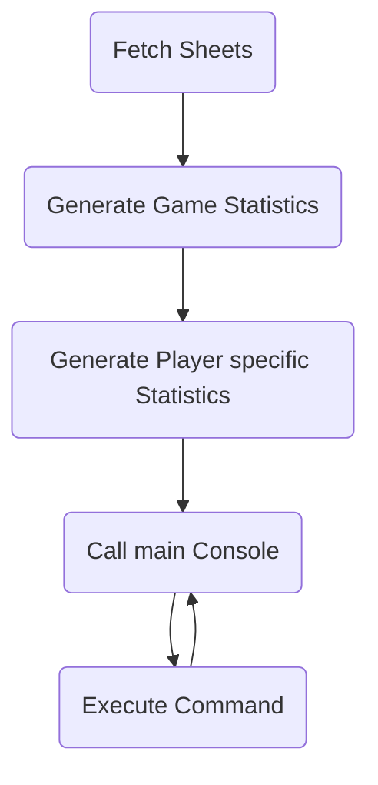
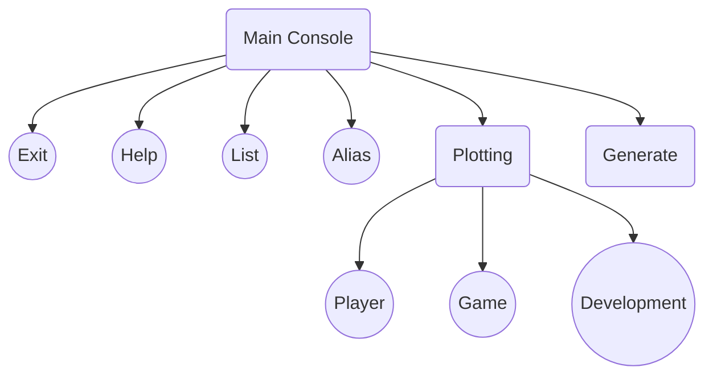

# Klausurersatzleistung Informatik
David J. Kowalk

[Rendered Version](https://davidkowalk.github.io/Doppelkopf_Analyser/documentation/html/Klausurersatzleistung)

# Das Spiel
Doppelkopf ist ein Kartenspiel in dem es darum geht las spiel von zwei Personen die größte Anzahl der 240 zu vergebenden Punkten in Form von Karten zu ergattern. Diese Punkte werden dann zu Abrechnungspunkten, abhängig von der Gewinnstufe (120, 90, 60, 30, Schwarz) und der Vorhersage der Spieler, umgerechnet und dem gewinnenden Team positiv, und dem verlierenden Team negativ aufgerechnet. Zudem wird der Wert des Spiels positiv notiert, wenn die Re-Partei gewinnt, und negativ, wenn die Contra Partei gewinnt.

**Beispiel:**

|S1|S2|S3|S4|Game
|--|--|--|--|--|
|2 | 2|-2|-2|+2|
|5 |-1| 1|-5|-3|
|6 | 0| 0|-6|-1|
|2 | 4|-4|-2|+4|


# Funktion
Es ist für jeden Spieler, wie auch für das Spiel insgesammt pro Partei die Gewinnchance zu ermitteln. Zudem soll die durchschnittliche Wertigkeit eines gewonnen Spiels für jeden Spieler errechnet werden.

## Konkrete Aufführung
- Berechnung und Darstellung von Spielstatistiken (Gewinnwahrscheinlichkeit für jede Gruppe)
- Berechnen der Spielerstatistik.
	- Gewinnwahrscheinlichkeit für jede Gruppe.
	- Durchschnittliche Punktzahlen pro Spiel.
	- Durchschnittliche Gewinnwahrscheinlichkeit am Ende jedes Blattes.
- Generierung von Spielstatistiken für eine definierte Teilmenge der Daten.
- Auflisten von Spieler auf und definieren von Aliasen.


# Durchführung

Die einzelnen Spiele werden im csv-Format gespeichert und vom Programm beim Start eingelesen.

## Auswertung des Gesamt-Spiels
Für jede Zeile wird gezählt, welche Partei gewonnen hat. Ist der Wert des Spiels positiv, hat die Re-Partei gewonnen, ist er negativ die Contra-Partei und andererseits liegt ein Unentschieden vor. Sonderspiele (Hochzeit, Trumpfarmut, Solor, etc.) werden hierbei nicht gezählt. Sind die Daten erhoben kann berechnet werden:

> f: Gewinnrate
>
> w: Anzahl der gewonnenen Spiele
>
> p: Anzahl der gespielten Spiele

$$
f_{Partei} = \frac{w_{Partei}}{p_{Partei}}
$$

Zunächst werden die Datenstrukturen definiert.
```
games = 0
wins = [0, 0, 0] #Re, Contra, Tie
```
Nun werden für die gewinnende Partei gewonnene und insgesammt gespielte Spiele gezählt.
```
for sheet in sheets:
    for row_int in range(1, len(sheet)):

        row = sheet[row_int]
        if len(row) == 5:
            games += 1
            if int(row[4]) >= 1:
                wins[0] += 1
            elif int(row[4]) <= -1:
                wins[1] += 1
            else:
                wins[2] += 1
```

## Auswertung der Spieler-Statistiken
Zunächst wird die Datenstruktur definiert, in der die Spielerstatistiken notiert werden. Hierfür kann in Python ein Dictionary verwendet werden:
```
games = {}

for player in player_list:
    games[player] = {
            "r": {"played":0, "won":0, "score":0},
            "c": {"played":0, "won":0, "score":0},
            "sheet_stats":[],
            "prev": 0
        }

games["total"] = 0
```

Es wird nun zunächst pro Runde bestimmt, welche Partei gewonnen hat und welche Partei der jeweilige Spieler angehört hat.

```
if gamescore > 0:
	winning_party = "re"
elif gamescore < 0:
	winning_party = "contra"

loosing_party = other_party[winning_party]

if playerscore > previous_playerscore:
	player_party = winning_party
else:
	player_party = loosing_party
```

Hat der Spieler die jeweilige Runde gewonnen, so wird auf seine Gewinnrunden und die Teilnahmen für die jeweilige Partei einen aufgezählt, sonst nur auf die Teilnahmen der verlierenden Partei.

## Programmfluss

Die Hauptkonsole ruft weitere Funktionen auf, welche das Kommando ausführen:

